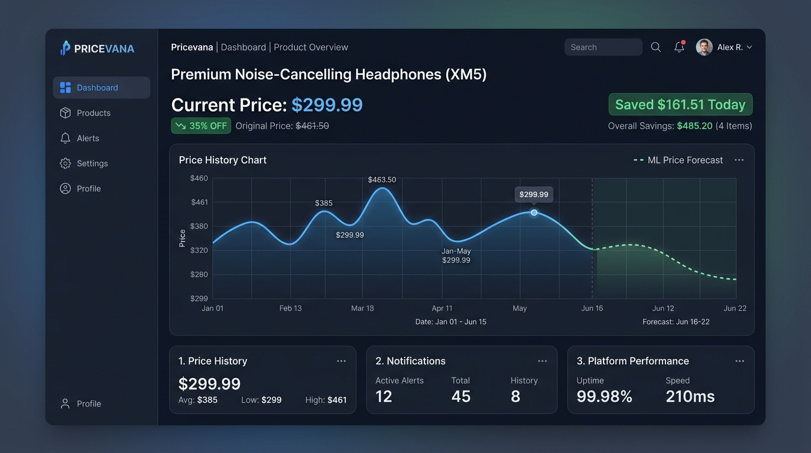
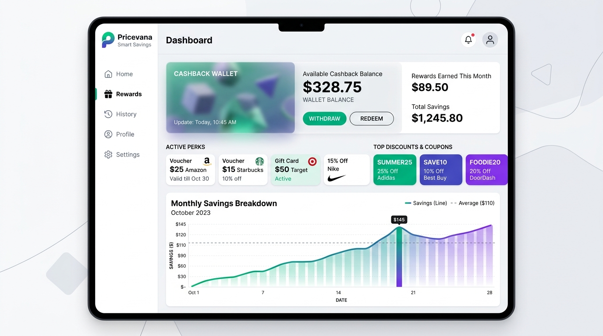
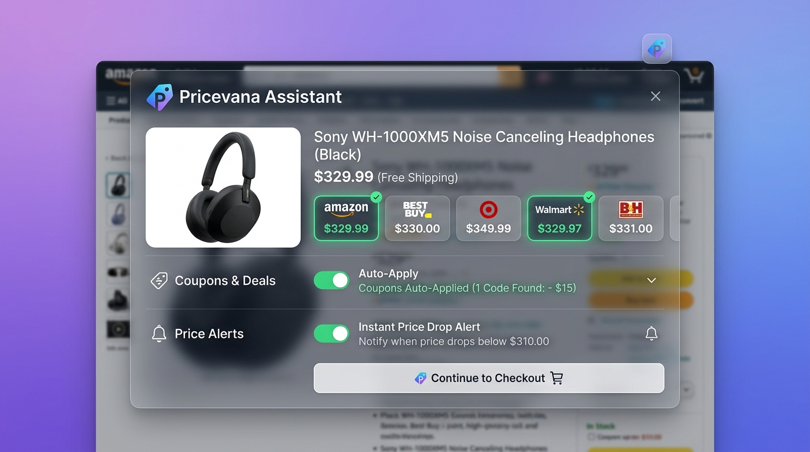

# 💰 Pricevana

> **An intelligent price-tracking and product-discovery platform that helps shoppers decide when and where to buy.**

🌐 **Live Demo:** https://pricevana.vercel.app/

Pricevana combines web scraping, historical price analytics, machine learning, and coupon discovery into a single shopping-assistant experience. Paste a product URL from supported marketplaces and Pricevana analyzes pricing signals, estimates near-term movement, and helps identify better times to purchase.

---

## 🖼️ Project Preview

### Smart Price Tracking


### Smart Savings


### Browser Assistant


---

## ✨ Key Features

| Feature | Description |
| --- | --- |
| 🔎 Product URL Analysis | Analyze product links from Amazon India, Flipkart, and Myntra |
| 📈 Price History | Visualize historical price movement and identify previous lows |
| 🤖 ML Price Prediction | Uses linear regression to estimate a product's near-term 7-day price trajectory |
| 🎯 Buy-Timing Score | Dynamic gauge communicates whether the current price looks bad, stable, or good |
| 🏷️ Coupon Discovery | Scans available promotional codes and evaluates potential savings |
| 🖼️ Product Image Extraction | Reads product metadata such as OpenGraph/Twitter images for fast visual previews |
| 💸 Savings Workspace | Track discounts, cashback information, notifications, and price-drop alerts |
| 🌍 Multi-Environment Frontend | Frontend can switch request targets for local development or production deployment |

---

## 🧠 How It Works

```text
Product URL
    ↓
Pricevana Frontend
    ↓
Flask REST API
    ├── Product / metadata extraction
    ├── Marketplace scraping
    ├── Historical price analysis
    ├── Linear regression prediction
    └── Coupon / savings analysis
    ↓
Analytics shown in dashboard
```

### Price prediction
The backend fits a lightweight **linear regression model** to available pricing data and uses it to estimate the next **7 days** of price movement.

> **Important:** Predictions are estimates based on the available scraped/historical data and should not be treated as guaranteed future prices.

---

## 🏗️ Technical Architecture

### Frontend
- HTML5
- Vanilla CSS
- Modular ES6 JavaScript
- Responsive dashboard UI
- Canvas-based charts
- CSS conic-gradient gauge visualization

### Backend
- Python
- Flask
- Flask-CORS
- scikit-learn
- Selenium
- HTML/meta parsing

### Data & Intelligence
- Historical price processing
- Linear regression
- Product metadata extraction
- Marketplace-specific scraping logic
- Coupon discovery workflows

---

## 📂 Repository Structure

```text
Pricevana/
├── backend/
│   ├── app.py                  # Flask REST API, scraping & analytics
│   ├── requirements.txt        # Python dependencies
│   └── Procfile                # PaaS process configuration (Render/Railway)
│
├── frontend/
│   ├── index.html              # Main web application dashboard
│   └── static/
│       ├── style.css           # UI styles and responsive animations
│       ├── script.js           # Client-side application logic & API client
│       ├── logo.jpg            # Brand logo & favicon
│       └── images/
│           ├── hero-price-tracker.webp
│           ├── smart-savings.webp
│           ├── browser-assistant.webp
│           └── stores/          # Retailer / partner logos
│
├── tests/
│   └── test_app.py             # Automated unit tests for all REST API routes
│
├── .env.example                # Template for environment variables
├── .gitignore                  # Git ignore rules for Python, IDE, and OS artifacts
├── Procfile                    # Root deployment process definition
├── vercel.json                 # Vercel deployment configuration
└── README.md                   # Project documentation
```

---

## 🚀 Run Locally

### 1. Clone

```bash
git clone https://github.com/Deepanshu779/Pricevana.git
cd Pricevana
```

### 2. Start the backend

```bash
cd backend
pip install -r requirements.txt
python app.py
```

The Flask API runs locally on:

`http://127.0.0.1:5000`

### 3. Start the frontend

Open a second terminal:

```bash
cd frontend
python -m http.server 8000
```

Open:

`http://localhost:8000`

### 4. Run Automated Tests

Run the backend test suite:

```bash
python -m unittest tests/test_app.py -v
```

---

## 🌐 Deployment

| Layer | Platform | URL |
| --- | --- | --- |
| Frontend | Vercel | https://pricevana.vercel.app/ |
| Backend | Render | https://pricevana.onrender.com |

---

## 📊 Product Decision Flow

```text
Check Product
      ↓
Current Price
      ↓
Historical Trend ─────┐
      ↓               │
ML 7-Day Forecast     │
      ↓               │
Buy-Timing Score ←────┘
      ↓
Coupon / Savings Check
      ↓
Suggested Purchase Decision
```

---

## 🔧 Supported Shopping Signals

Pricevana is designed around several signals that can be combined before buying:

- Current listed price
- Historical price behavior
- Estimated short-term trend
- Previous low price
- Discount/coupon opportunities
- Store/product metadata

---

## 🔮 Future Improvements

- Add richer historical-price storage instead of generated/simulated history where applicable
- Introduce stronger time-series forecasting models
- Expand marketplace coverage
- Add user accounts with persistent watchlists
- Add browser-extension integration for one-click analysis
- Add scheduled price monitoring and notifications
- Improve scraping resilience against marketplace markup changes
- Add automated backend/frontend tests and CI

---

## 👨‍💻 Author

**Deepanshu Kumar Pandit**

GitHub: [@Deepanshu779](https://github.com/Deepanshu779)

---

## ⭐ Support

If Pricevana helps you make better buying decisions, consider giving the repository a ⭐ on GitHub.

**Live Demo:** https://pricevana.vercel.app/